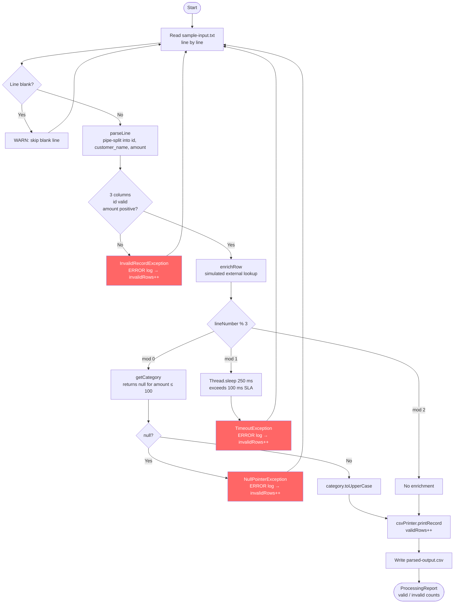
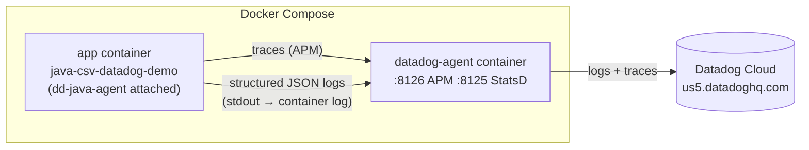

# java-csv-datadog-demo

A Java application that reads a pipe-delimited CSV file, validates and enriches each row, writes a clean output CSV, and ships structured logs and traces to Datadog via the dd-java-agent.

## Flow



## Architecture



## Intentional Bugs

| Error | Trigger | Root Cause |
|-------|---------|------------|
| `NullPointerException` | `lineNumber % 3 == 0`, amount ≤ 100 | `getCategory()` returns `null`; caller calls `.toUpperCase()` without null check |
| `TimeoutException` | `lineNumber % 3 == 1` | `enrichRow` sleeps 250 ms but SLA threshold is 100 ms |
| `InvalidRecordException` | Malformed lines (bad amount, missing columns) | `parseLine` validates format strictly |

## Prerequisites

- Docker + Docker Compose
- Datadog account — API key with `logs_write` scope
- `.env` file (or shell env vars):

```
DD_API_KEY=<your-api-key>
DD_SITE=us5.datadoghq.com   # or datadoghq.com
```

## Running

```bash
# Build and run (produces errors intentionally)
docker-compose up --build

# Or run locally with Gradle (requires dd-java-agent built first)
./gradlew run
```

Input: `data/sample-input.txt` — Output: `data/parsed-output.csv`

## Project Structure

```
src/main/java/com/example/csvdatadog/
├── App.java                  # Entry point
├── CsvFileProcessor.java     # Core parsing, enrichment, error handling
├── InvalidRecordException.java
└── ProcessingReport.java
data/
├── sample-input.txt          # Pipe-delimited input with intentional bad rows
└── parsed-output.csv         # Clean output (valid rows only)
```
